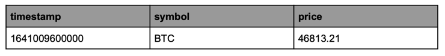

# Documentation
This project was created as part of task assignment for an interview. Main concept is to build recommendation service that will help users to make investments in cryptos. (Task Description section below). 

## Task Description

It’s time for developers to invest their salaries on cryptos. The problem is that we have no idea of cryptos, so we are feeling a little bit afraid which crypto to choose. But is this actually a problem? Of course not! We are developers and we always implement solutions for all the problems we face.
For this one, we decided to build a recommendation service. Initially, we will build something simple and through iterations we are going to transform it to a gold miner.
In the CRYPTO_NAME_values.csv (e.g. BTC_values.csv) you can find one month’s prices for one crypto in USD. The file has the following format:


### Requirements for the recommendation service:
- Reads all the prices from the csv files 
- Calculates oldest/newest/min/max for each crypto for the whole month
Exposes an endpoint that will return a descending sorted list of all the cryptos,
comparing the normalized range (i.e. (max-min)/min)
- Exposes an endpoint that will return the oldest/newest/min/max values for a requested
crypto
- Exposes an endpoint that will return the crypto with the highest normalized range for a
specific day

### Things to consider:
- Documentation is our best friend, so it will be good to share one for the endpoints
- Initially the cryptos are only five, but what if we want to include more? Will the
recommendation service be able to scale?
- New cryptos pop up every day, so we might need to safeguard recommendations service
endpoints from not currently supported cryptos
- For some cryptos it might be safe to invest, by just checking only one month's time
frame. However, for some of them it might be more accurate to check six months or even a year. Will the recommendation service be able to handle this?

### Extra mile for recommendation service (optional):
- In our company we run everything on Kubernetes, so containerizing the recommendation service will add great value
- Malicious users will always exist, so it will be really beneficial if at least we can rate limit them (based on IP)

## Installation
This project was created using OpenJDK Runtime Environment 17. You can follow instructions below to run the project.
Clone this project in some directory on your computer. Then run command below

``` bash 
mvn clean package
```
After all was compiled successful run next command
``` bash
docker-compose up --build
```
You should have both services running

# Description of end-points behavior
The CryptoStatsController is a REST controller providing an API for analyzing cryptocurrency statistics. It allows users to retrieve data about cryptocurrencies sorted by various parameters, as well as data on normalized ranges and specific statistics.

## 1. List of All Cryptocurrencies Sorted by Normalized Range
**Endpoint:**
`GET /crypto/stats/normalized`

**Description:** Returns a list of all cryptocurrencies sorted by their normalized range (from highest to lowest). The normalized range is calculated as the difference between the maximum and minimum value, divided by the minimum value.

**Sample Response:**
```json
[
     {
        "currency_code": "ETH",
        "statistics": {
            "normalized_range": 0.63838
        }
    },
    {
        "currency_code": "XRP",
        "statistics": {
            "normalized_range": 0.51786
        }
    }

]
```

## 2. Statistics for a Specific Cryptocurrency (Oldest, Newest, Min, Max Prices)
**Endpoint:**
` GET /crypto/stats/{symbol}`

**Path Parameters:**
symbol (string): The cryptocurrency symbol (e.g., BTC, ETH).

**Description:**
Returns detailed information about the cryptocurrency, including:
The oldest price.
The newest price.
The minimum price.
The maximum price.

**Sample Response:**
```json
{
    "currency_code": "ETH",
    "statistics": {
        "min_price": 2336.52,
        "max_price": 3828.11,
        "oldest_date_time": "01-01-2022 10:00:00",
        "newest_date_time": "31-01-2022 22:00:00"
    }
}
```

## 3. Cryptocurrency with the Highest Normalized Range for a Given Day ##
**Endpoint:**
`GET /crypto/stats/highest?day=15&month=01&year=2022`

**Query Parameters:**
day (int): The day.
month (int): The month.
year (int): The year.

**Description:**

Returns the cryptocurrency with the highest normalized range for the specified day.

**Sample Response:**
```json
{
    "currency_code": "LTC",
    "statistics": {
        "normalized_range": 0.02143
    }
}
```

## Important note:
Due to main reason for this task as assignment follow aspects should be taken in consideration:
1. It is important to note that certain aspects of the functionality demonstration in this project differ from how it would be implemented in a production environment.
2. This project uses a combined approach to data operations:
    1. The project connects to a database hosted in a separate container, where all the data
       read from files is stored. From my perspective, the most optimal approach is not to execute SQL queries every time data is needed. Instead, a query can be made to the database to fetch and store data into an object, which can subsequently be used to retrieve the required information.
    2. This object-oriented approach avoids repeated database calls, provided that the SQL query is well-constructed to fetch all necessary data upfront. This method is considered "combined" as it involves pre-processing data via SQL and further processing it in the application code.
    3. The SQL queries presented in the repository (for the repository package) are primarily for demonstration purposes, proving the application's functionality and the ability to fetch data from the database when needed.
    4. For databases with large datasets, it is critical to analyze frequently used queries. These endpoints can benefit from caching mechanisms (e.g., Redis).
    5. Additionally, large dataset SQL queries should incorporate LIMIT and OFFSET for pagination to improve performance and handle data more efficiently.
6. This application consists of two microservices.
    1. **crypto-analyzer**: Responsible for the application's core logic.
    2. **gateway-service**: Serves as a proxy to manage requests to the main microservice.
3. The **gateway-service** is included for demonstration purposes. It can be further configured
    1. Filtering unwanted IP addresses.
    2. Redirecting invalid or malicious requests.
    3. Implementing security measures to protect the main service.
5. The main service (**crypto-analyzer**) implements the required logic and exposes three endpoints to return the results, as per the project requirements. Detailed documentation for these endpoints is included in the project repository.
6. Unit tests have been added to validate the service's functionality. This aspect can be expanded as needed to improve code coverage with more unit tests.
7. The project is designed to run autonomously, requiring no manual intervention to read and process data from files. The data is automatically saved to the database, enabling the use of SQL queries to retrieve or filter specific information.

### Key Considerations:
This section provides an overview of important design choices and recommendations made during the development of the project.
1. The project's documentation, including the description of the main functional endpoints, is available in the repository.
2. The project is designed to facilitate the addition of new data (e.g., new cryptocurrencies). This can be achieved by:
    1. Adding new configurations to the application.yml and placing new data files in the resources folder with convention name like AAA_values.csv
    2. Alternatively, a dedicated endpoint is provided to directly upload data files into the project. This feature is shown as a proof of concept in the FileProcessingController, without implementation in the controller. It can be added to enhance usability.
    3. If the requested cryptocurrency type is not supported, the service notifies the user accordingly.
    4. The service **already supports** generating statistics for a specific **time period**. This feature can be extended by adding a new endpoint where users specify the desired time interval to retrieve statistics for a specific cryptocurrency.

### Extra Mile Section:
1. The application is containerized using Docker and can be launched as a container (the recommended approach). However, it can also run locally if required.
2. As mentioned earlier, the gateway-service can be configured to block malicious IPs or URLs, providing an additional security layer for the main service.

### Recommendations for Project Improvements:
1. Replace file-based data uploads with integrations to specialized APIs to fetch data dynamically.
2. Instead of displaying data solely in JSON format, consider adding graphical representations, such as tables or charts, for better user experience (depending on client requirements).
3. Since the service is investment-oriented, it would be beneficial for the service to offer recommendations or insights to users about which cryptocurrencies are most profitable for investment at a given time.

The project's implementation might slightly differ from main expectations. Some other features can be added later but this depends on time and complexity. 
